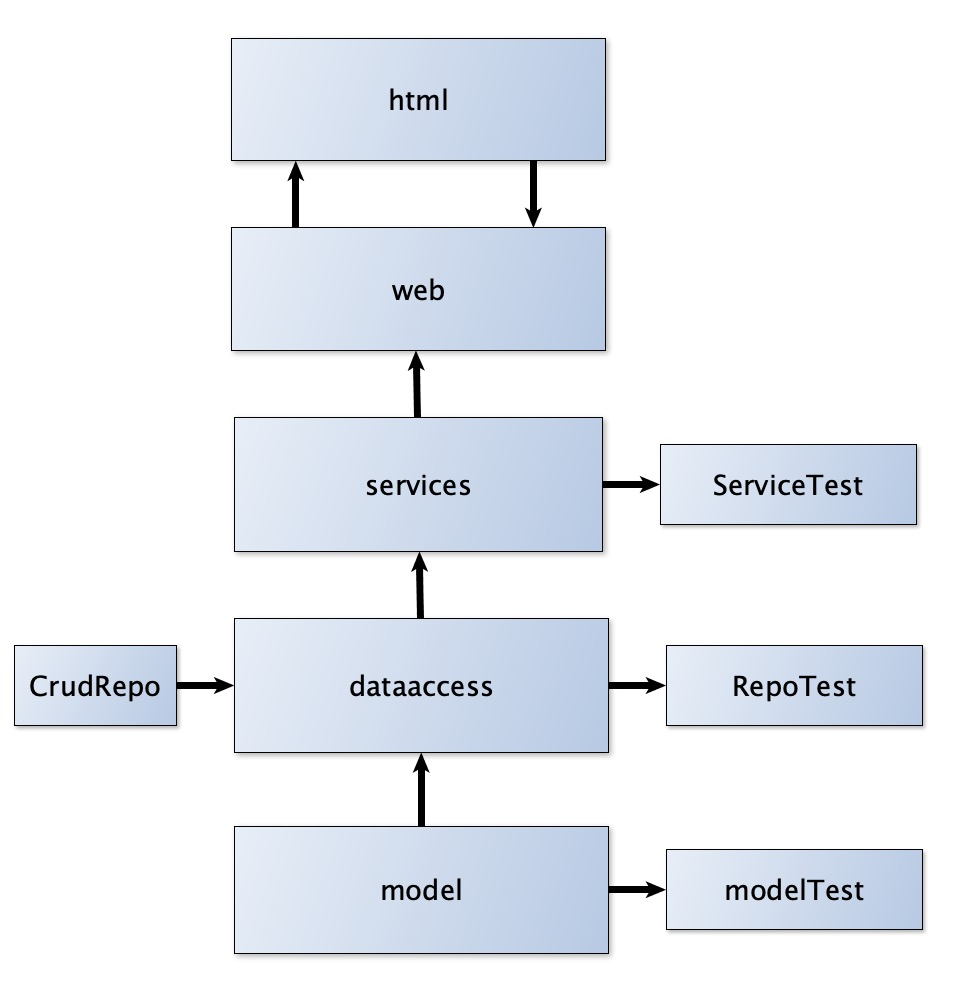
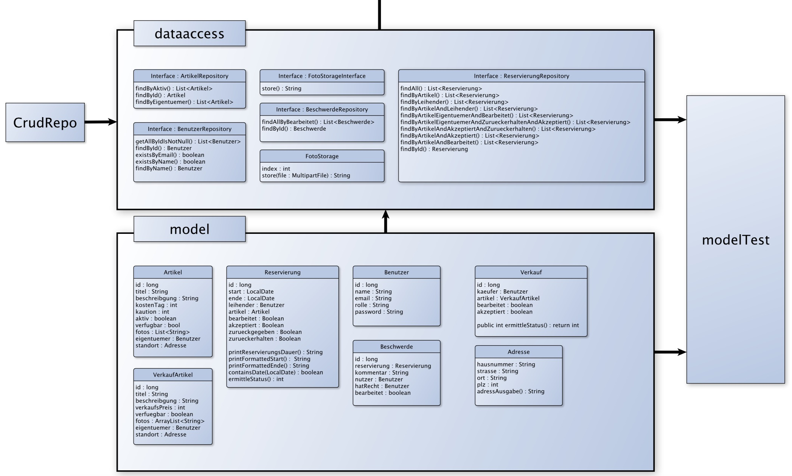
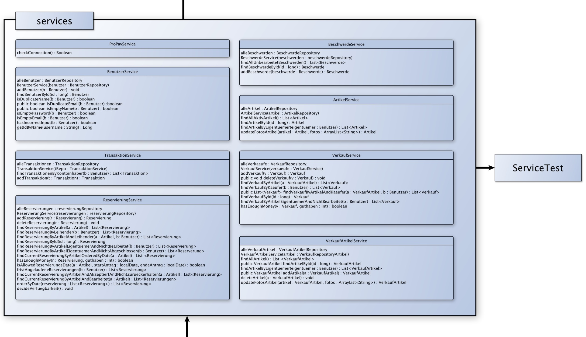
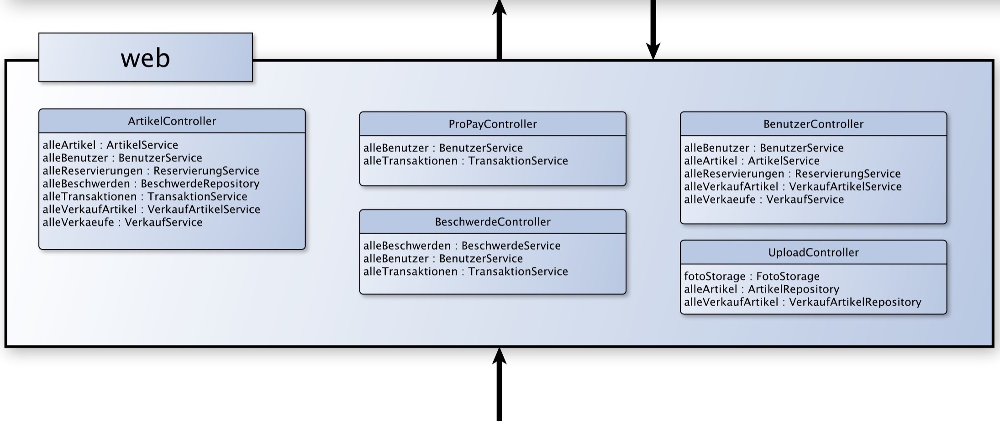
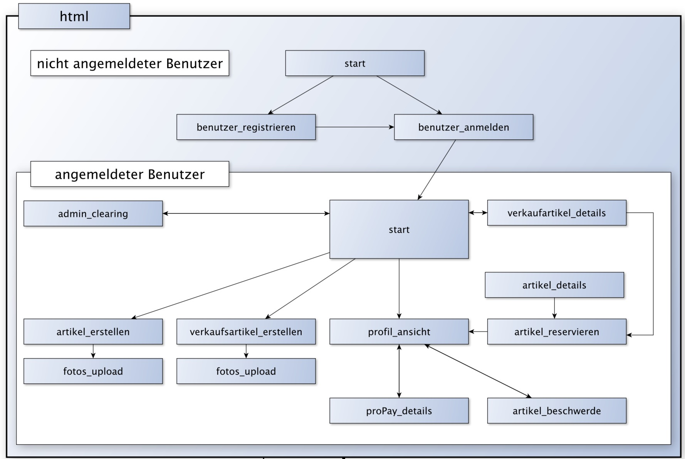

= Aufbau und Testing

=== Struktur

==== Anwendung und Geschäftslogik

Die Geschäftslogik, darunter verstehen wir hier alles, was in Java geschrieben ist und direkt zum Betrieb der Anwendung beiträgt sind in folgende fünf Packages unterteilt:

Das Package model enthält alle benötigten Klassen bzw. Entitäten. Das Package dataaccess erbt vom CrudRepository und erweitert das Interface um weitere Funktionen.

Die Services enthalten den Hauptteil der Logik, die von den Controllern verwendet wird.

Die Controller mappen auf die aufgerufenen URL's entsprechende Funktionen, redirecten auf Folgeseiten und interagieren mit den html-Templates.

Die html-Templates stellen die Benutzerschnittstelle zur Verfügung und führen über die URL's gewünschte Funktionen aus. Sie sind aus Nutzersicht in zwei Bereiche aufgeteilt. Der nicht-eingeloggte Benutzer hat nur beschränkt Zugriff. Erst nach dem Login kann die Anwendung umfänglich genutzt werden.

=== Testing

Wir testen bislang einerseits die Repositories und die Methoden der Modell-Objekte (sofern sie welche haben), andererseits die Services, welche Logik enthalten, die ansonsten im Controller untergebracht und damit schwer zu testen wären.

==== modelTest
Wir haben die Testklassen für die Repositories jeweils so aufgebaut, dass wir zunächst die benötigten Objekte erzeugen und diese dann mit der Annotatioin @Before vor jedem Test neu in die Datenbank speichern. Mit @After wird die Datenbank nach jedem Test wieder gelehrt. Alle Klassen enthalten Tests, die die Korrekte Wiedergewinnung und Aktualisierung der Daten, welche an die Datenbank geschickt werden, überprüfen. Zudem werden sämtliche überschriebenen Methoden aus den Repositories getestet. Wenn Klassen aus model über Methoden verfügen, werden diese ebenfalls getestet.

==== serviceTests
Die Logik in den Services enthält sowohl simple als auch komplexere Methoden. Bei ersteren reicht teilweise ein sinnvoller Test, bei Letzteren haben wir möglichst viele Fälle abgedeckt, bei denen Fehler auftreten können. So wird z.B. die Methode isAllowedReservierungsDate aus dem ReservierungsService darauf getestet, dass sie ein illegales Anfangsdatum, Enddatum, Anfangs- und Enddatum oder eine ungültige Reservierung mit legalem Anfangs- und Enddatum erkennt. Auch die Grenzfälle (nur Start- oder Enddatum einer Reservierung sind illegal) werden getestet.
