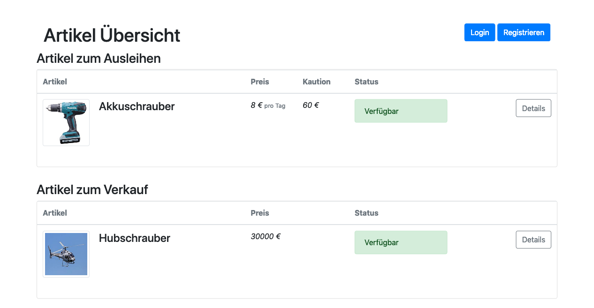
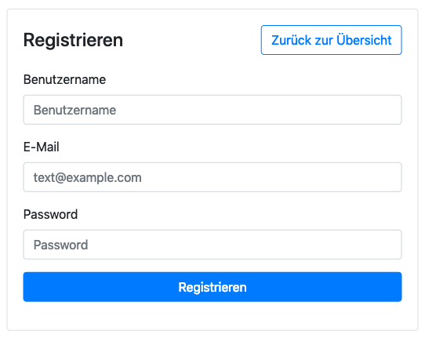
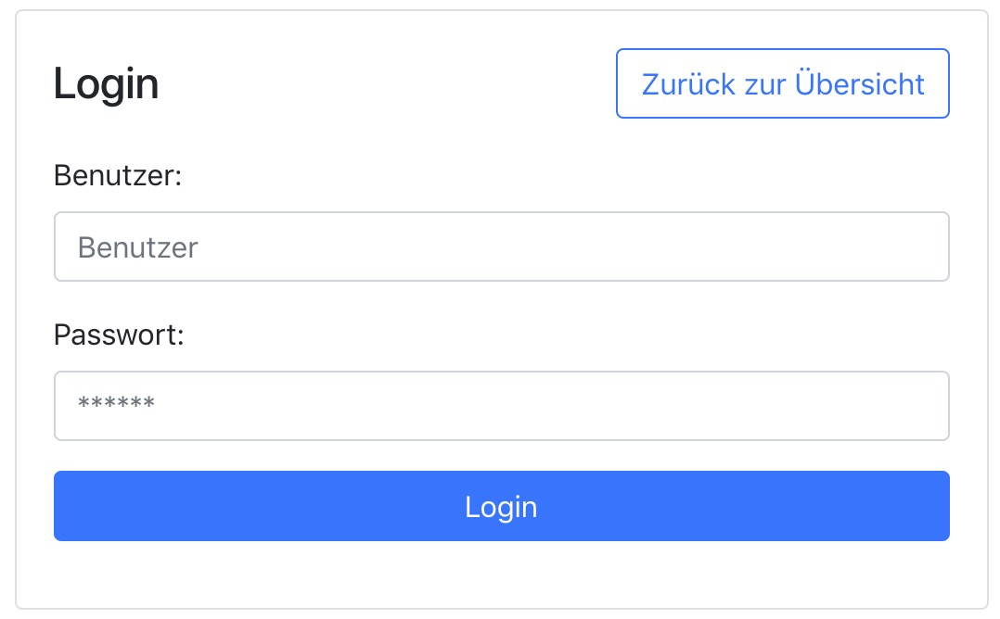
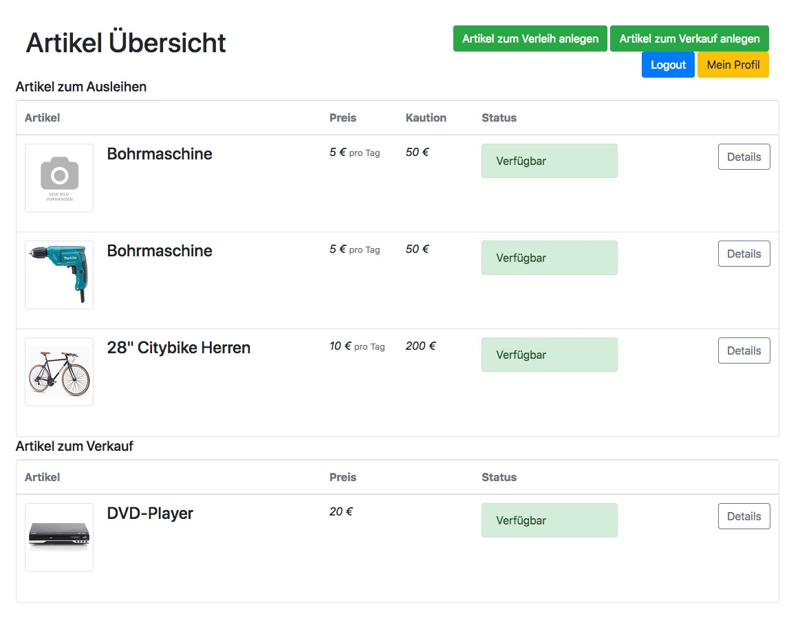
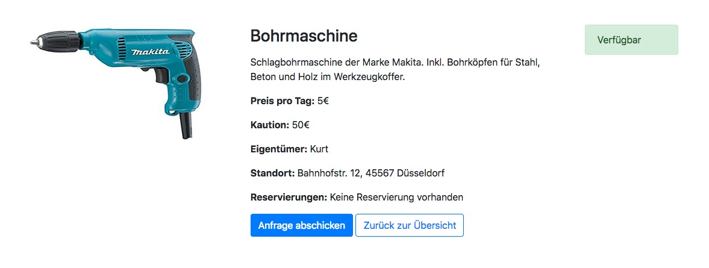
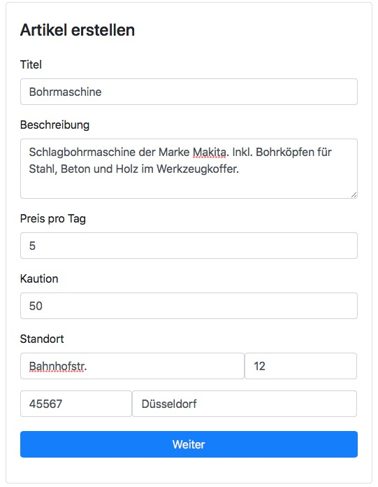
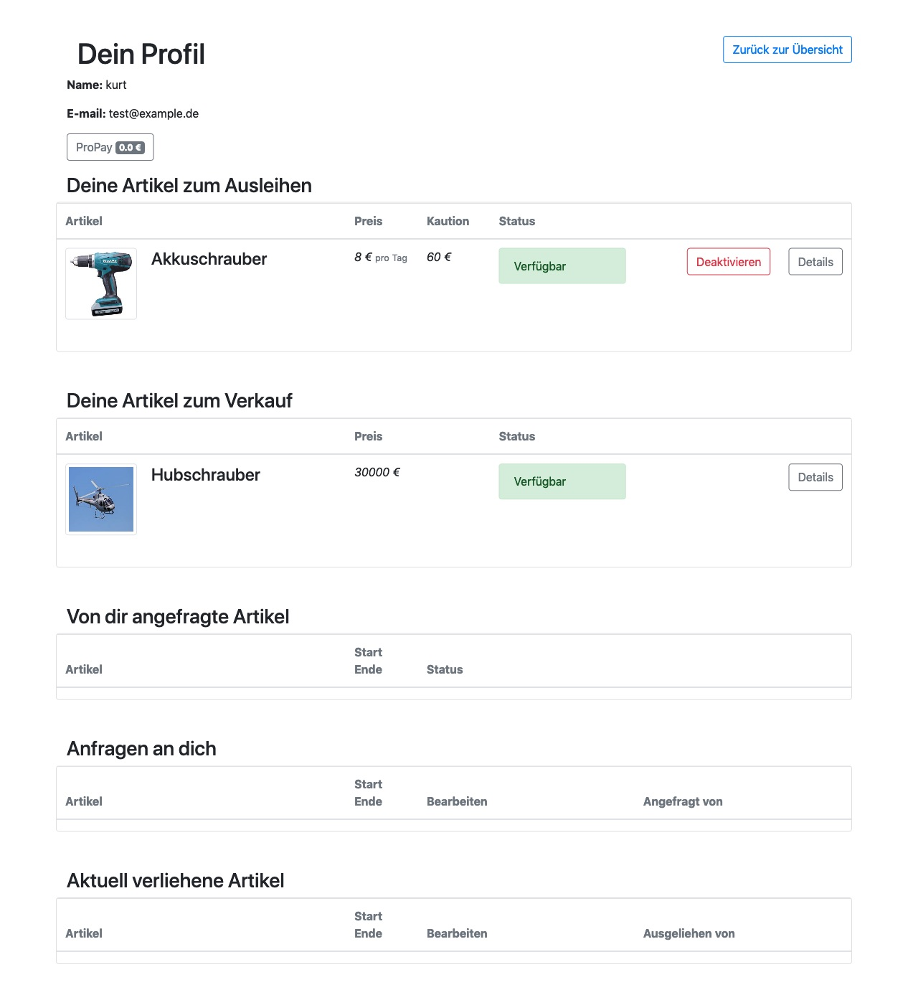
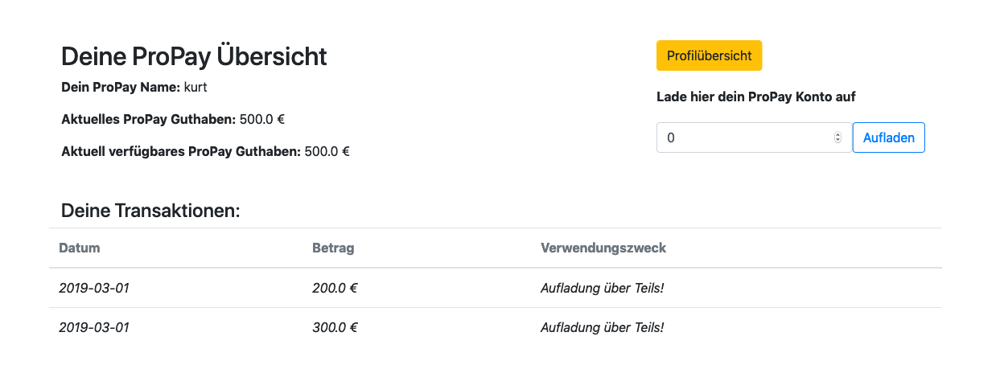
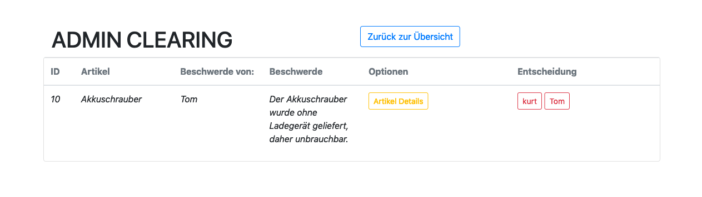

= User Walkthrough

==== Benutzer

Die Anwendung ist mit `docker-compose up` über das Terminal zu starten. Danach ist die Startseite mit dem Browser über `http://localhost:8080` zu erreichen.

Die Startseite enthält eine Übersicht der Artikel, die zum Verleih oder zum Verkauf angeboten werden. Hier sieht man den Mietpreis, die Kaution und ob der Artikel in diesem Moment mietbar/kaufbar ist.

Der Benutzer kann sich hier über das `Registrieren` Button mit Namen, Email-Adresse und einem Passwort registrieren.

Nach der Registrierung wird der Benutzer auf die Login-Seite weitergeleitet und kann sich mit Name und Passwort einloggen.

Nach dem Login wird der Benutzer auf die Startseite weitergeleitet, die nun erweiterte Funktionen bietet. Jetzt kann der Benutzer sich die Details der Artikel anzeigen lassen, selber Artikel zum Verleih oder zum Verkauf erstellen oder seine Profilseite einsehen.

Über die `Details` Buttons neben jedem Artikel gelangt der Benutzer auf die Details-Seite der Artikel. Hier kann der Benutzer die Reservierungen mit Start und Enddatum sehen und mit über das Button `Anfrage abschicken` selbst eine Anfrage machen. Mit `Zurück zur Übersicht` gelangt er wieder zur Übersichtseite.

Mit den Buttons `Artikel zum Verleih anlegen` bzw. `Artikel zum Verkauf anlegen` kann der User eigene Artikel anlegen und mit `weiter`  bis zu 10 Artikelfotos hinzufügen und speichern.

Von der Übersichtseite gelangt der Benutzer auf seine Profilseite. Hier erhält er eine Auflistung aller seiner Produkte, Anfragen und Verleihprozesse. Verleih- und Kaufanfragen kann er hier akzeptieren oder ablehnen, sich bei Problemen beschweren und Artikel, die er nicht mehr anbieten will, deaktivieren. Hier sieht er auch sein aktuelles ProPay Guthaben.

Klickt er auf das ProPay Button gelangt er auf seine ProPay Kontoübersicht. Hier kann er sein Guthaben aufladen und sieht eine Liste von Transaktionen.

==== Admin
Der Admin hat neben allen Möglichkeiten, die ein Benutzer hat, zusätzlich auf der Übersichtseite ein Button zu den Beschwerden. Hier sieht er eine Auflistung aller Beschwerden und kann zu Gunsten einer der Streitparteien entscheiden. Die Kaution wird dem, zu dessen Gunsten entschieden wurde, gutgeschriben und die Reservierung gilt als abgeschlossen.

Mit dem Logout Button auf der Übersichtsseite können sich Admins und Benutzer wieder abmelden.
